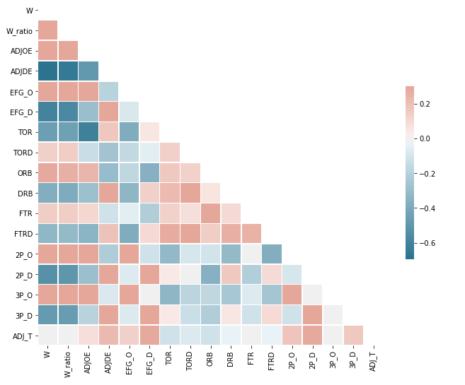
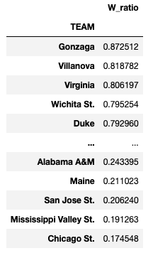
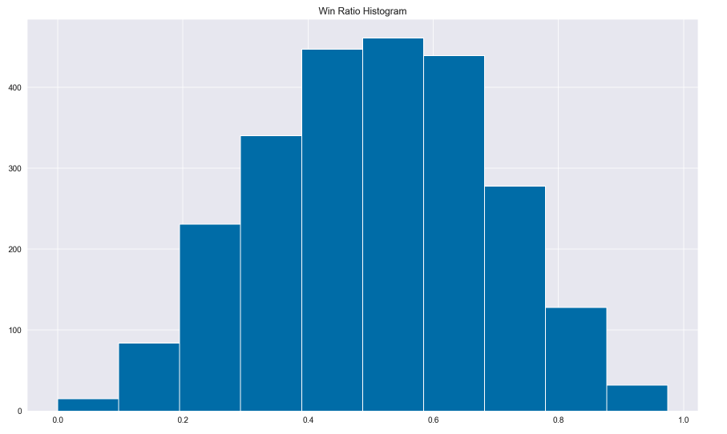

# College Basketball Win Ratio Estimator: Project Overview
- Created a model that estimates College Basketball Win Ratio (R^2  ~ 0.86) to draw insights into variables that are most impactful for team success
- Focussed on interpretable machine learning model of linear regression, as the motivation behind the model was to be implemented in personal planning of coaching plan for first grade, high school basketball team
- Checked Linear Regression Assumptions and re-evaluated variable choices to attend to multicollinearity issues
- Model highlights the importance of reducing turnovers when on offence and forcing turnovers when on defence, with these variables having the largest coefficients 
- Practical coaching implications include focussing on fundamentals of basketball (solid footwork, emphasis on making the easy pass) and a proactive approach to defense (half-court press/trap)

## Code and Resources Used
**Python Version:** 3.7  
**Packages:** pandas, numpy, matplotlib, seaborn, statsmodels, scipy
**College Basketball Dataset:** https://www.kaggle.com/andrewsundberg/college-basketball-dataset  
**Checking Linear Regression Assumptions:** https://towardsdatascience.com/verifying-the-assumptions-of-linear-regression-in-python-and-r-f4cd2907d4c0

## Variables:

All variables in dataset

 

- TEAM: The Division I college basketball school

- CONF: The Athletic Conference in which the school participates in (A10 = Atlantic 10, ACC = Atlantic Coast Conference, AE = America East, Amer = American, ASun = ASUN, B10 = Big Ten, B12 = Big 12, BE = Big East, BSky = Big Sky, BSth = Big South, BW = Big West, CAA = Colonial Athletic Association, CUSA = Conference USA, Horz = Horizon League, Ivy = Ivy League, MAAC = Metro Atlantic Athletic Conference, MAC = Mid-American Conference, MEAC = Mid-Eastern Athletic Conference, MVC = Missouri Valley Conference, MWC = Mountain West, NEC = Northeast Conference, OVC = Ohio Valley Conference, P12 = Pac-12, Pat = Patriot League, SB = Sun Belt, SC = Southern Conference, SEC = South Eastern Conference, Slnd = Southland Conference, Sum = Summit League, SWAC = Southwestern Athletic Conference, WAC = Western Athletic Conference, WCC = West Coast Conference)

- G: Number of games played

- W: Number of games won

- ADJOE: Adjusted Offensive Efficiency (An estimate of the offensive efficiency (points scored per 100 possessions) a team would have against the average Division I defense)

- ADJDE: Adjusted Defensive Efficiency (An estimate of the defensive efficiency (points allowed per 100 possessions) a team would have against the average Division I offense)

- BARTHAG: Power Rating (Chance of beating an average Division I team)

- EFG_O: Effective Field Goal Percentage Shot

- EFG_D: Effective Field Goal Percentage Allowed

- TOR: Turnover Percentage Allowed (Turnover Rate)

- TORD: Turnover Percentage Committed (Steal Rate)

- ORB: Offensive Rebound Rate

- DRB: Offensive Rebound Rate Allowed

- FTR : Free Throw Rate (How often the given team shoots Free Throws)

- FTRD: Free Throw Rate Allowed

- 2P_O: Two-Point Shooting Percentage

- 2P_D: Two-Point Shooting Percentage Allowed

- 3P_O: Three-Point Shooting Percentage

- 3P_D: Three-Point Shooting Percentage Allowed

- ADJ_T: Adjusted Tempo (An estimate of the tempo (possessions per 40 minutes) a team would have against the team that wants to play at an average Division I tempo)

- WAB: Wins Above Bubble (The bubble refers to the cut off between making the NCAA March Madness Tournament and not making it)

- POSTSEASON: Round where the given team was eliminated or where their season ended (R68 = First Four, R64 = Round of 64, R32 = Round of 32, S16 = Sweet Sixteen, E8 = Elite Eight, F4 = Final Four, 2ND = Runner-up, Champion = Winner of the NCAA March Madness Tournament for that given year)

- SEED: Seed in the NCAA March Madness Tournament

- YEAR: Season

**Final variables in model:** W_ratio (W/G), TOR, TORD, ORB, DRB, 2P_O, 2P_D, 3P_O, 3P_D
- These variables were chosen to attend to multicollinearity issues and are practical in tracking from a coaching perspective

## Data Cleaning

- Due to the nature of the data, the dataset was noticably clean in terms of formatting of variables and entries and missing values
- Made column for whether team made it into the postseason for potential further classification research
- Created win ratio column as total number of games played slightly differed between teams

## EDA

Distributions of the data, pivot tables and correlation plots were obsvered. Below are some notable highlights from this exploration.

## Model Building

- Multiple Linear Regression was the main choice for model building as the resulting model would be easily interpretable, assisting with constructing season training plans for my personal basketball coaching
- Full OLS Model revealed high VIF among all variables, highlighting multicollinearity issues
- Choice of select variables resulted in VIF < 2 which is not problematic 
- Following linear regression assumptions were checked and seen to hold: linearity, expectation of residuals = 0, multicollinearity, normality

## Implications

- Stress importance of taking care of the ball and making the easy, simple pass
- Integrating fundamental footwork and passing into drills where possible
- Taking a proactive approach to defence, utilising half/full court traps and presses to force turnovers
